# System Architecture

## Overview

This page consolidates the backend architecture that is actually implemented today in the repository.

## Repository Snapshot

| Aspect | Current State |
| --- | --- |
| Implemented services | `1` |
| Dominant stack | Spring Boot, JPA, PostgreSQL, Liquibase |
| Current API emphasis | Authentication-first surface in `user-service` |
| Documentation stance | Describe implemented code, not conceptual microservices |

## Implemented Components

- `user-service`

## Service Snapshots

### user-service

| Aspect | Current State |
| --- | --- |
| Service | `user-service` |
| Spring application name | `user-service` |
| Default local port | `8080` |
| HTTP endpoints detected | `3` |
| Persisted entities detected | `4` |
| Implementation slices | `config`, `controller`, `dto`, `entity`, `helper`, `mapper`, `repository`, `service`, `web` |

## Layered Structure

- Requests enter through controller interfaces and controller implementations.
- Business orchestration lives in service and helper classes.
- Persistence is handled through repositories, JPA entities, and schema-management files.
- Cross-cutting concerns such as security and rate limiting are wired from configuration and web layers.

## Cross-Cutting Concerns

### user-service

| Concern | Current State |
| --- | --- |
| Security | Dedicated configuration detected. |
| Rate limiting | Interceptor-based auth rate limiting detected. |
| Observability | Auth metrics instrumentation detected. |
| Persistence | JPA entities and repositories are present. |

## Interactions

### user-service

```mermaid
%%{init: {
  "theme": "base",
  "themeVariables": {
    "background": "#1c2c29",
    "primaryColor": "#24443d",
    "primaryTextColor": "#ffcc66",
    "primaryBorderColor": "#73e5c6",
    "lineColor": "#ffb347",
    "secondaryColor": "#203934",
    "tertiaryColor": "#294c44",
    "mainBkg": "#24443d",
    "secondBkg": "#203934",
    "tertiaryBkg": "#294c44",
    "clusterBkg": "#17312d",
    "clusterBorder": "#57c8a8",
    "nodeBkg": "#24443d",
    "nodeBorder": "#73e5c6",
    "defaultLinkColor": "#ffb347",
    "titleColor": "#ffcc66",
    "textColor": "#ffcc66",
    "edgeLabelBackground": "#17312d",
    "actorBkg": "#24443d",
    "actorBorder": "#73e5c6",
    "actorTextColor": "#ffcc66",
    "actorLineColor": "#ffb347",
    "signalColor": "#ffb347",
    "signalTextColor": "#ffcc66",
    "labelBoxBkgColor": "#17312d",
    "labelBoxBorderColor": "#57c8a8",
    "labelTextColor": "#ffcc66",
    "loopTextColor": "#ffcc66",
    "noteBkgColor": "#294c44",
    "noteBorderColor": "#82e7cb",
    "noteTextColor": "#ffcc66",
    "activationBkgColor": "#2c5a50",
    "activationBorderColor": "#73e5c6",
    "sectionBkgColor": "#1b3531",
    "altSectionBkgColor": "#22413b",
    "gridColor": "rgba(255, 179, 71, 0.22)"
  },
  "themeCSS": ".messageText, .messageText tspan, .label text, .label tspan, .edgeLabel text, .edgeLabel tspan, .nodeLabel, .nodeLabel p, .nodeLabel span, .label foreignObject, .label foreignObject div, .cluster-label text, .cluster-label tspan, .actor text, .actor tspan, .loopText, .noteText, .er text, .er tspan, .er.entityLabel, .er.attributeText, .er.relationshipLabel, .er foreignObject div, .er foreignObject span, .er foreignObject td, .er foreignObject th { fill: #ffcc66 !important; color: #ffcc66 !important; } .messageLine0, .messageLine1, .flowchart-link, .edgePath path, .actor-line, .er.relationshipLine { stroke: #ffb347 !important; fill: none !important; } .arrowheadPath, marker path { stroke: #ffb347 !important; fill: #ffb347 !important; } .er rect, .er .entityBox, .er .attributeBoxEven, .er .attributeBoxOdd { fill: #24443d !important; stroke: #73e5c6 !important; } .er .relationshipLabelBox { fill: #17312d !important; stroke: #57c8a8 !important; } .er foreignObject, .er foreignObject div, .er foreignObject table { background: #24443d !important; } .er foreignObject tr:nth-child(odd), .er foreignObject tr:nth-child(odd) td { background: #24443d !important; } .er foreignObject tr:nth-child(even), .er foreignObject tr:nth-child(even) td { background: #2b4f47 !important; } .er foreignObject td, .er foreignObject th { border-color: #73e5c6 !important; }"
}}%%
flowchart LR
  Client[Client App] --> Api["REST API / Controllers"]
  Api --> Service["Service Layer and Helpers"]
  Service --> Repo["Repositories"]
  Repo --> Db[("PostgreSQL")]
  Api --> Security["Security Config"]
  Api --> RateLimit["Rate Limit Interceptors"]
```

## Evolution Notes

- The current repository is centered on the implemented services above. Any broader microservice picture should be treated as target architecture until more concrete services and integrations appear in code.
