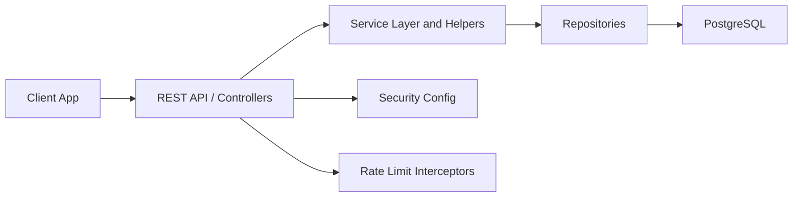

# System Architecture

## Overview
This page consolidates the backend architecture **actually implemented** in the repository today. It provides a snapshot of the current system state, focusing on tangible code and infrastructure.

## Repository Snapshot
| Aspect              | Current State               |
| ------------------- | ---------------------------- |
| Implemented services | `1`                         |
| Dominant stack      | Spring Boot, JPA, PostgreSQL, Liquibase |
| Current API emphasis| Authentication-first surface in `user-service` |
| Documentation stance| Describe implemented code, not conceptual microservices |

## Implemented Components

- `user-service`

## Service Details (`user-service`)
| Aspect                                 | Current State             |
| -------------------------------------- | -------------------------- |
| Service name                           | `user-service`             |
| Spring application name               | `user-service`             |
| Default local port                    | `8080`                    |
| Endpoints                            | `6` HTTP endpoints detected |
| Persisted entities                    | `4`                     |
| Implementation slices                | `config`, `controller`, `domain`, `helper`, `mapper`, `repository`, `service`, `web` |

## Layered Structure

<u>Requests</u> enter through <u>controller</u> interfaces and controller implementations. <u>Business</u> orchestration lives in <u>service</u> and <u>helper</u> classes. <u>Persistence</u> is handled through repositories, JPA entities, and schema-management files. <u>Cross-cutting concerns</u> such as security and rate limiting are wired from configuration and web layers.

## Cross-Cutting Concerns (`user-service`)
| Concern              | Current State                      |
| --------------------- | ----------------------------------- |
| Security             | Dedicated configuration detected. |
| Rate limiting          | <u>Interceptor-based</u> auth rate limiting detected |
| Observability        | Auth metrics instrumentation detected  |
| Persistence          | <u>JPA</u> entities and repositories present  |

## Evolution Notes
The current repository is centered on the <u>implemented services</u> listed above. <u>Any broader microservice picture</u> should be treated as a *target architecture* rather than current fact, to avoid misrepresentation.
