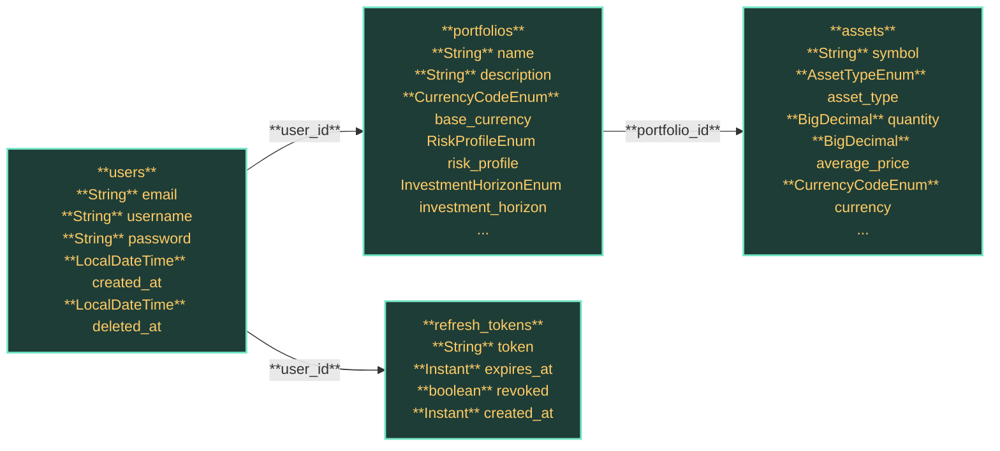

# Database Overview

## Core Services

The repository implements a centralized database model for persistent data storage and retrieval.

### User Service Schema
This service manages user authentication, portfolio management, and asset tracking using a relational database structure.

## Key Entities

| Table | Entity | Type | Key Links |
| --- | --- | ---- | --------- |
| `assets` | `AssetEntity` | Asset data storage | Portfolio |
| `portfolios` | `PortfolioEntity` | User portfolio management | Asset, User |
| `refresh_tokens` | `RefreshTokenEntity` | Authentication token storage | User |
| `users` | `UserEntity` | User account management | Portfolio |

<u>`portfolio_id`</u> connects `portfolios` to `users` and `assets`.
`user_id` establishes relationships between `users`, `portfolios`, and `refresh_tokens`.

## Relationships

## Technical Considerations
- All database interactions must maintain JPA mapping integrity
- Liquibase change sets must be properly utilized for schema modifications
- Strict adherence to entity relationships and foreign key constraints required when implementing persistence layer changes

## Source of Truth
This document provides the authoritative source for the current database schema structure and relationships.
