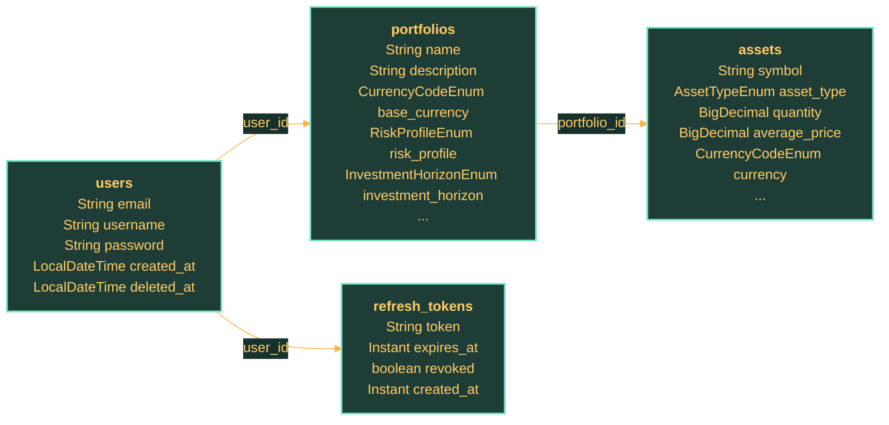

# Database Overview

## Overview

This page consolidates the implemented database model across the repository.

## Snapshot

| Aspect | Current State |
| --- | --- |
| Implemented services with persistence | `1` |
| Total detected entities | `4` |
| Liquibase-backed services | `1` |

## Implemented Service Schemas

## user-service

### Snapshot

| Aspect | Current State |
| --- | --- |
| Service | `user-service` |
| Detected entities | `4` |
| Tables represented | `4` |
| Many-to-one relations | `3` |
| Liquibase changelogs | Present |

### Implemented Entities

| Table | Entity | Role | Key Links |
| --- | --- | --- | --- |
| `assets` | `AssetEntity` | Represents an asset position that belongs to a portfolio. | Portfolio |
| `portfolios` | `PortfolioEntity` | Groups assets and investment preferences owned by a user. | Asset, User |
| `refresh_tokens` | `RefreshTokenEntity` | Stores refresh tokens, expiry, and revocation state linked to a user. | User |
| `users` | `UserEntity` | Stores the primary user identity and credential state. | Portfolio |

### Relationships

### Schema Coverage

- The ER diagram is derived from JPA entities, so it reflects object relationships that are implemented in code now.
- Liquibase changelogs should be read together with the entities when reviewing schema evolution or rollout risk.
- Refresh-token persistence is part of the core auth contract, not just an implementation detail, because rotation and revocation depend on this table.
- Portfolio and asset tables are already present in persistence, even if the current HTTP surface is still centered on authentication.

### Constraints and Persistence Notes

- Treat JPA entities and schema-management files as the source of truth for persistence details.
- Review nullability, token revocation flags, timestamps, and foreign-key ownership in code before changing this page.
- Liquibase changelogs are present and should be checked together with entities when schema behavior changes.

## Constraints and Persistence Notes

- Review nullability, unique constraints, token lifecycle flags, timestamps, and join columns in code before changing this page.
- Prefer entities and changelogs over older Markdown when the two diverge.

## Source of Truth

- JPA entities and changelog files are the source of truth for this page.
