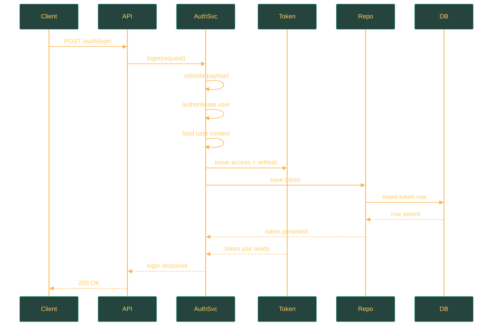
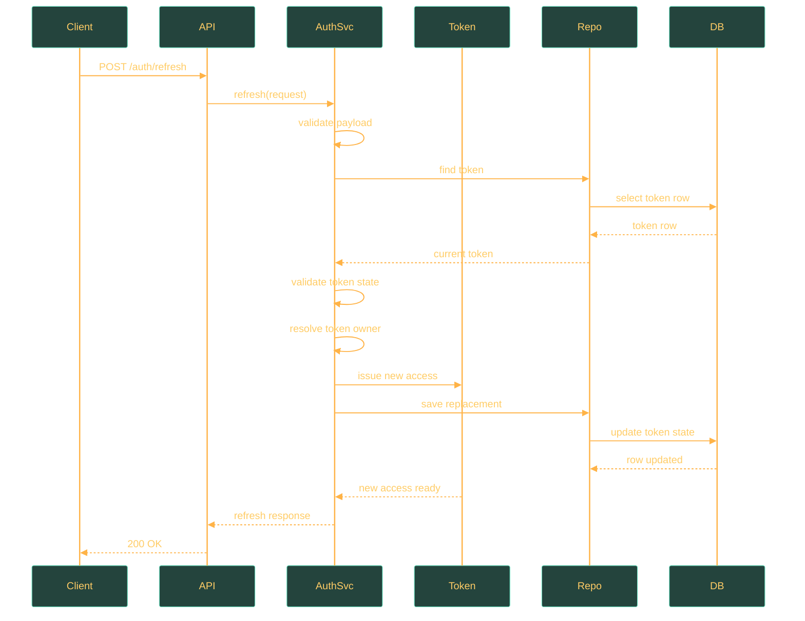

# User Service API

## Overview

This page consolidates the implemented HTTP surface for `user-service`. It replaces the older split between authentication, flow, and sequence pages and focuses only on contracts that are visible in code today.

## Base Paths and API Surface

| Aspect | Value |
| --- | --- |
| Base path families | `/tyche-wealth/user-service/v1/auth`, `/tyche-wealth/user-service/v1/user`, `/tyche-wealth/user-service/v1/user/me` |
| Source of truth | `*Api.java` contracts plus DTOs, service helpers, and centralized error handling |
| Detected APIs | `AuthApi.java`, `UserApi.java` |

## Endpoint Summary

### `AuthApi.java`

| Method | Path | Purpose | Operational Note |
| --- | --- | --- | --- |
| `POST` | `/tyche-wealth/user-service/v1/auth/register` | Creates a new user account and returns the created user representation. | Persists a new active user record and is subject to dedicated registration rate limiting and uniqueness checks. |
| `POST` | `/tyche-wealth/user-service/v1/auth/login` | Authenticates a user and returns `tokenType`, `accessToken`, `refreshToken`, `expiresIn`, and the mapped user representation. | Validates credentials, revokes any previously active refresh tokens for the user, issues a new access token and refresh token, and records auth metrics. |
| `POST` | `/tyche-wealth/user-service/v1/auth/refresh` | Validates the submitted refresh token, rotates refresh-token state, and returns `tokenType`, `accessToken`, `expiresIn`, and a replacement refresh token. | Revokes the submitted active refresh token, persists a replacement refresh token, returns a new access token, and fails with `401` when the provided refresh token is invalid, expired, or already revoked. |
| `POST` | `/tyche-wealth/user-service/v1/auth/logout` | Accepts a refresh token request body and logs the user out by revoking the submitted active refresh token. | Requires a valid refresh-token request body, revokes the submitted active refresh token, and returns `204 No Content`; it does not implement server-side access-JWT invalidation or cache cleanup. |

### `UserApi.java`

| Method | Path | Purpose | Operational Note |
| --- | --- | --- | --- |
| `GET` | `/tyche-wealth/user-service/v1/user/me` | Returns the authenticated active user's `id`, `email`, `username`, and `createdAt`; sensitive fields such as `password`, `deletedAt`, and related collections are omitted from the response DTO. | Requires a valid `Authorization: Bearer <token>` header for an active non-deleted user and returns only the mapped user DTO fields. |
| `PATCH` | `/tyche-wealth/user-service/v1/user/me` | Updates the authenticated active user's profile fields and returns the updated `id`, `email`, `username`, and `createdAt` values from the response DTO. | Requires a valid bearer token for an active non-deleted user, enforces username availability checks, persists the update, and returns the updated user DTO. |
| `PATCH` | `/tyche-wealth/user-service/v1/user/me/password` | Changes the authenticated active user's password after validating the current password and returns no response body. | Requires a valid bearer token for an active non-deleted user, validates the current password, updates the stored password hash, revokes active refresh tokens, and returns `204 No Content`. |
| `DELETE` | `/tyche-wealth/user-service/v1/user/me` | Soft-deletes the authenticated active user by setting `deletedAt`, preserves the stored record, revokes active refresh tokens, and returns no response body. | Requires a valid bearer token for an active non-deleted user, revokes active refresh tokens, performs a soft delete by setting `deletedAt`, and returns `204 No Content`. |

## Implemented Endpoints

### `POST /tyche-wealth/user-service/v1/auth/register`

#### Purpose

Creates a new user account and returns the created user representation.

#### Contract

| Contract Item | Value |
| --- | --- |
| Success status | `201 Created` |
| Source API | `AuthApi.java` |
| Request DTO | `RegisterRequestDto` |
| Response DTO | `UserResponseDto` |

#### Validation Snapshot

| Input | Rules |
| --- | --- |
| `email` | Must not be blank.; Must be a valid email address.; Length must be at most 254 characters.; Value is normalized before downstream validation and persistence checks. |
| `username` | Must not be blank.; Length must be between 3 and 30 characters.; Value is normalized before downstream validation and persistence checks. |
| `password` | Must not be blank.; Length must be at least 8 characters.; Must match the configured format policy. |

#### Runtime Constraints

- Service-layer checks: email and username are normalized and must remain unique before user creation proceeds.
- Dedicated rate limiting: registration requests are intercepted through the register rate-limit configuration.
- Validation failures are aggregated by the centralized `ErrorHandler` instead of being returned ad hoc from each controller method.

#### Error Behavior

| Status | When it happens |
| --- | --- |
| `400 Bad Request` | DTO validation fails, request JSON is malformed, or an auth-specific password format rule rejects the payload. |
| `409 Conflict` | Registration collides with an existing email or username, either during pre-checks or at the persistence layer. |
| `429 Too Many Requests` | The endpoint-specific rate-limit interceptor blocks the request because the active window has been exceeded. |
| Error payload shape | Centralized through `ErrorHandler`, which maps validation, auth, rate-limit, and generic failures to the API response contract. |

---

### `POST /tyche-wealth/user-service/v1/auth/login`

#### Purpose

Authenticates a user and returns `tokenType`, `accessToken`, `refreshToken`, `expiresIn`, and the mapped user representation.

#### Contract

| Contract Item | Value |
| --- | --- |
| Success status | `200 OK` |
| Source API | `AuthApi.java` |
| Request DTO | `LoginRequestDto` |
| Response DTO | `LoginResponseDto` |

#### Validation Snapshot

| Input | Rules |
| --- | --- |
| `email` | Must not be blank.; Must be a valid email address.; Length must be at most 254 characters.; Value is normalized before downstream validation and persistence checks. |
| `password` | Must not be blank.; Length must be at least 8 characters.; Must match the configured format policy. |

#### Runtime Constraints

- Service-layer checks: email is normalized before lookup and the password must satisfy the login password policy before credential matching.
- Dedicated rate limiting: login requests are intercepted through the login rate-limit configuration.
- Validation failures are aggregated by the centralized `ErrorHandler` instead of being returned ad hoc from each controller method.

#### Error Behavior

| Status | When it happens |
| --- | --- |
| `400 Bad Request` | DTO validation fails, request JSON is malformed, or an auth-specific password format rule rejects the payload. |
| `401 Unauthorized` | Email does not resolve to a user or the provided password does not match the stored hash. |
| `429 Too Many Requests` | The endpoint-specific rate-limit interceptor blocks the request because the active window has been exceeded. |
| Error payload shape | Centralized through `ErrorHandler`, which maps validation, auth, rate-limit, and generic failures to the API response contract. |

---

### `POST /tyche-wealth/user-service/v1/auth/refresh`

#### Purpose

Validates the submitted refresh token, rotates refresh-token state, and returns `tokenType`, `accessToken`, `expiresIn`, and a replacement refresh token.

#### Contract

| Contract Item | Value |
| --- | --- |
| Success status | `200 OK` |
| Source API | `AuthApi.java` |
| Request DTO | `RefreshTokenRequestDto` |
| Response DTO | `RefreshTokenResponseDto` |

#### Validation Snapshot

| Input | Rules |
| --- | --- |
| `refreshToken` | Must not be blank. |

#### Runtime Constraints

- Service-layer checks: the refresh token must be present, resolvable, not revoked, and still within its validity window before rotation succeeds.
- Dedicated rate limiting: refresh requests are intercepted through the refresh rate-limit configuration.
- Validation failures are aggregated by the centralized `ErrorHandler` instead of being returned ad hoc from each controller method.

#### Error Behavior

| Status | When it happens |
| --- | --- |
| `400 Bad Request` | DTO validation fails, request JSON is malformed, or an auth-specific password format rule rejects the payload. |
| `401 Unauthorized` | Refresh token is missing, invalid, revoked, expired, or otherwise rejected during refresh-token validation. |
| `429 Too Many Requests` | The endpoint-specific rate-limit interceptor blocks the request because the active window has been exceeded. |
| Error payload shape | Centralized through `ErrorHandler`, which maps validation, auth, rate-limit, and generic failures to the API response contract. |

---

### `POST /tyche-wealth/user-service/v1/auth/logout`

#### Purpose

Accepts a refresh token request body and logs the user out by revoking the submitted active refresh token.

#### Contract

| Contract Item | Value |
| --- | --- |
| Success status | `204 No Content` |
| Source API | `AuthApi.java` |
| Request DTO | `RefreshTokenRequestDto` |
| Response DTO | `Void` |

#### Validation Snapshot

| Input | Rules |
| --- | --- |
| `refreshToken` | Must not be blank. |

#### Runtime Constraints

- Validation failures are aggregated by the centralized `ErrorHandler` instead of being returned ad hoc from each controller method.

#### Error Behavior

| Status | When it happens |
| --- | --- |
| `400 Bad Request` | DTO validation fails, request JSON is malformed, or an auth-specific password format rule rejects the payload. |
| Error payload shape | Centralized through `ErrorHandler`, which maps validation, auth, rate-limit, and generic failures to the API response contract. |

---

### `GET /tyche-wealth/user-service/v1/user/me`

#### Purpose

Returns the authenticated active user's `id`, `email`, `username`, and `createdAt`; sensitive fields such as `password`, `deletedAt`, and related collections are omitted from the response DTO.

#### Contract

| Contract Item | Value |
| --- | --- |
| Success status | `200 OK` |
| Source API | `UserApi.java` |
| Request DTO | `N/A` |
| Response DTO | `UserResponseDto` |

#### Validation Snapshot

| Input | Rules |
| --- | --- |
| Request body | No request DTO is associated with this endpoint. |

#### Runtime Constraints

- Validation failures are aggregated by the centralized `ErrorHandler` instead of being returned ad hoc from each controller method.

#### Error Behavior

| Status | When it happens |
| --- | --- |
| `400 Bad Request` | DTO validation fails, request JSON is malformed, or an auth-specific password format rule rejects the payload. |
| Error payload shape | Centralized through `ErrorHandler`, which maps validation, auth, rate-limit, and generic failures to the API response contract. |

---

### `PATCH /tyche-wealth/user-service/v1/user/me`

#### Purpose

Updates the authenticated active user's profile fields and returns the updated `id`, `email`, `username`, and `createdAt` values from the response DTO.

#### Contract

| Contract Item | Value |
| --- | --- |
| Success status | `200 OK` |
| Source API | `UserApi.java` |
| Request DTO | `UserUpdateRequestDto` |
| Response DTO | `UserResponseDto` |

#### Validation Snapshot

| Input | Rules |
| --- | --- |
| `username` | Must not be blank.; Length must be between 3 and 30 characters.; Value is normalized before downstream validation and persistence checks. |

#### Runtime Constraints

- Validation failures are aggregated by the centralized `ErrorHandler` instead of being returned ad hoc from each controller method.

#### Error Behavior

| Status | When it happens |
| --- | --- |
| `400 Bad Request` | DTO validation fails, request JSON is malformed, or an auth-specific password format rule rejects the payload. |
| Error payload shape | Centralized through `ErrorHandler`, which maps validation, auth, rate-limit, and generic failures to the API response contract. |

---

### `PATCH /tyche-wealth/user-service/v1/user/me/password`

#### Purpose

Changes the authenticated active user's password after validating the current password and returns no response body.

#### Contract

| Contract Item | Value |
| --- | --- |
| Success status | `204 No Content` |
| Source API | `UserApi.java` |
| Request DTO | `UserPasswordUpdateRequestDto` |
| Response DTO | `Void` |

#### Validation Snapshot

| Input | Rules |
| --- | --- |
| `currentPassword` | Must not be blank.; Length must be at least 8 characters. |
| `newPassword` | Must not be blank.; Length must be at least 8 characters.; Must match the configured format policy. |
| `confirmNewPassword` | Must not be blank. |

#### Runtime Constraints

- Validation failures are aggregated by the centralized `ErrorHandler` instead of being returned ad hoc from each controller method.

#### Error Behavior

| Status | When it happens |
| --- | --- |
| `400 Bad Request` | DTO validation fails, request JSON is malformed, or an auth-specific password format rule rejects the payload. |
| Error payload shape | Centralized through `ErrorHandler`, which maps validation, auth, rate-limit, and generic failures to the API response contract. |

---

### `DELETE /tyche-wealth/user-service/v1/user/me`

#### Purpose

Soft-deletes the authenticated active user by setting `deletedAt`, preserves the stored record, revokes active refresh tokens, and returns no response body.

#### Contract

| Contract Item | Value |
| --- | --- |
| Success status | `204 No Content` |
| Source API | `UserApi.java` |
| Request DTO | `N/A` |
| Response DTO | `Void` |

#### Validation Snapshot

| Input | Rules |
| --- | --- |
| Request body | No request DTO is associated with this endpoint. |

#### Runtime Constraints

- Validation failures are aggregated by the centralized `ErrorHandler` instead of being returned ad hoc from each controller method.

#### Error Behavior

| Status | When it happens |
| --- | --- |
| `400 Bad Request` | DTO validation fails, request JSON is malformed, or an auth-specific password format rule rejects the payload. |
| Error payload shape | Centralized through `ErrorHandler`, which maps validation, auth, rate-limit, and generic failures to the API response contract. |

## Flows and Sequence Diagrams

### Register Flow

### Login Sequence

### Refresh Sequence

### Refresh Token Lifecycle

## Notes

- Treat routes not listed here as not implemented unless a concrete controller or API contract is added.
- Use controller interfaces, DTOs, service implementations, and error handlers as the source of truth for API behavior.
