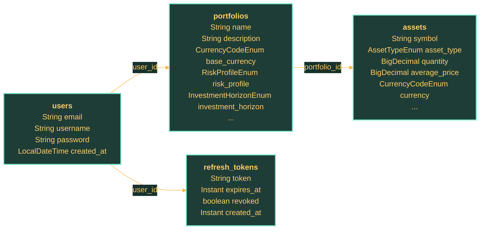

# User Service Data Model

## Overview

This page consolidates the persistence model for `user-service`. It replaces the older split between table pages, schema notes, and entity summaries.

## Entity Summary

| Entity | Table | Role | Key Relations |
| --- | --- | --- | --- |
| `AssetEntity` | `assets` | Represents an asset position that belongs to a portfolio. | PortfolioEntity |
| `PortfolioEntity` | `portfolios` | Groups assets and investment preferences owned by a user. | AssetEntity, UserEntity |
| `RefreshTokenEntity` | `refresh_tokens` | Stores refresh tokens, expiry, and revocation state linked to a user. | UserEntity |
| `UserEntity` | `users` | Stores the primary user identity and credential state. | PortfolioEntity |

## Implemented Entities

### `AssetEntity` (`assets`)

- Role: Represents an asset position that belongs to a portfolio.

#### Fields

| Column | Type | Required | Meaning | Notes |
| --- | --- | --- | --- | --- |
| `symbol` | `String` | Yes | Ticker or symbol used to identify the asset. | core identifier |
| `asset_type` | `AssetTypeEnum` | Yes | Classification of the asset instrument. | enum value |
| `quantity` | `BigDecimal` | Yes | Position size currently held in the portfolio. | No special note. |
| `average_price` | `BigDecimal` | Yes | Average acquisition price for the asset position. | No special note. |
| `currency` | `CurrencyCodeEnum` | Yes | Currency associated with the asset valuation. | enum value, currency context |
| `created_at` | `LocalDateTime` | Yes | Timestamp recording when the asset record was created. | timestamp |
| `updated_at` | `LocalDateTime` | No | Timestamp recording the most recent asset update. | timestamp |

#### Relations

- Many records point to `PortfolioEntity` through `portfolio_id`.

### `PortfolioEntity` (`portfolios`)

- Role: Groups assets and investment preferences owned by a user.

#### Fields

| Column | Type | Required | Meaning | Notes |
| --- | --- | --- | --- | --- |
| `name` | `String` | Yes | Short portfolio name shown to the user. | core identifier |
| `description` | `String` | No | Optional free-text description of the portfolio. | No special note. |
| `base_currency` | `CurrencyCodeEnum` | Yes | Reference currency used to express portfolio values. | enum value, currency context |
| `risk_profile` | `RiskProfileEnum` | No | Risk appetite classification linked to the portfolio. | enum value |
| `investment_horizon` | `InvestmentHorizonEnum` | No | Expected holding horizon for the portfolio strategy. | enum value |
| `strategy_type` | `StrategyTypeEnum` | No | Strategy style associated with the portfolio. | enum value |
| `max_risk` | `BigDecimal` | No | Optional cap on accepted portfolio risk. | No special note. |
| `created_at` | `LocalDateTime` | Yes | Timestamp recording when the portfolio was created. | timestamp |
| `updated_at` | `LocalDateTime` | No | Timestamp recording the most recent portfolio update. | timestamp |

#### Relations

- Many records point to `UserEntity` through `user_id`.
- One record owns a collection associated with `AssetEntity`.

### `RefreshTokenEntity` (`refresh_tokens`)

- Role: Stores refresh tokens, expiry, and revocation state linked to a user.

#### Fields

| Column | Type | Required | Meaning | Notes |
| --- | --- | --- | --- | --- |
| `token` | `String` | Yes | Opaque refresh-token value persisted for token rotation. | core identifier |
| `expires_at` | `Instant` | Yes | Instant after which the refresh token is no longer valid. | timestamp |
| `revoked` | `boolean` | Yes | Flag indicating whether the refresh token can still be used. | lifecycle flag |
| `created_at` | `Instant` | Yes | Timestamp recording when the refresh token was issued. | timestamp |

#### Relations

- Many records point to `UserEntity` through `user_id`.

### `UserEntity` (`users`)

- Role: Stores the primary user identity and credential state.

#### Fields

| Column | Type | Required | Meaning | Notes |
| --- | --- | --- | --- | --- |
| `email` | `String` | Yes | Primary email used to identify the user account. | core identifier |
| `username` | `String` | Yes | Public-facing or login-friendly user name. | core identifier |
| `password` | `String` | Yes | Stored password hash used during authentication. | sensitive credential data |
| `created_at` | `LocalDateTime` | Yes | Timestamp recording when the user record was created. | timestamp |

#### Relations

- One record owns a collection associated with `PortfolioEntity`.

## Relationships

## Persistence and Schema Notes

- Treat JPA entities and schema-management files as the source of truth for persistence details.
- Review nullability, token revocation flags, timestamps, and foreign-key ownership in code before changing this page.
- Liquibase changelogs are present and should be checked together with entities when schema behavior changes.

## Related Documentation

- `docs/knowledge/services/user-service/overview.md`
- `docs/knowledge/services/user-service/runtime.md`
- `docs/knowledge/database/overview.md`
