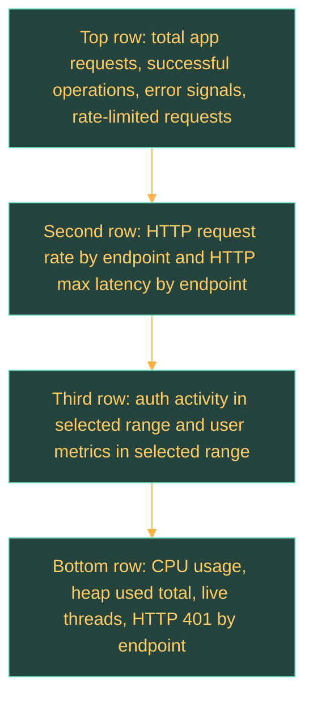

# User Service Observability

## Overview

This page explains the operational checks currently provided by the `user-service` Grafana dashboard and how those checks map to the metrics exposed by the service.

## Dashboard Summary

| Topic | Current State |
| --- | --- |
| Service | `user-service` |
| Dashboard file | `observability/grafana/dashboards/tyche-user-service-overview.json` |
| Datasource | Prometheus |
| Main scope | Auth flow, user flow, HTTP behavior, and runtime health |

## Dashboard Representation

The current dashboard is organized by diagnostic intent rather than by raw metric family.

## What The Dashboard Checks

| Area | Metrics used | What it helps validate |
| --- | --- | --- |
| App totals | `tyche_auth_*`, `tyche_user_*` | Whether the service is receiving requests and producing successful or failed domain operations. |
| HTTP traffic | `http_server_requests_*` | Which endpoints are active and whether request volume or latency shifts by route. |
| Auth flow | `tyche_auth_*` | Login, refresh, token issue, token revoke, and auth rate-limiting behavior in the selected range. |
| User flow | `tyche_user_*` | Retrieve, update, password update, delete, and user-domain error activity in the selected range. |
| Runtime health | `jvm_*`, `jdbc_*`, `system_cpu_usage` | CPU, heap pressure, live threads, and datasource health. |
| Unauthorized responses | `http_server_requests_seconds_count{status="401"}` | Which endpoints are returning `401` responses in the selected range. |

## Metric Notes

- `tyche_auth_*` metrics are business-facing auth counters and should be used to inspect auth flow outcomes rather than raw HTTP behavior alone.
- `tyche_user_*` metrics are business-facing user counters and include domain signals such as unauthorized user access, not found, or password-related validation failures.
- `http_server_requests_*` metrics provide the technical HTTP view and are useful when raw response behavior needs to be correlated with domain counters.
- `jvm_*` and `jdbc_*` metrics provide runtime context and should be read as supporting health signals rather than domain outcomes.

## Operational Notes

- Some panels are range-based, so they can legitimately appear empty when the selected time window does not include traffic for that flow.
- `tyche_user_unauthorized_total` is narrower than all HTTP `401` responses, which is why the dashboard also includes a dedicated `HTTP 401 by endpoint` view.
- This page should be updated whenever the dashboard layout, Prometheus queries, or service metrics change in a way that alters what the operational view is intended to confirm.
