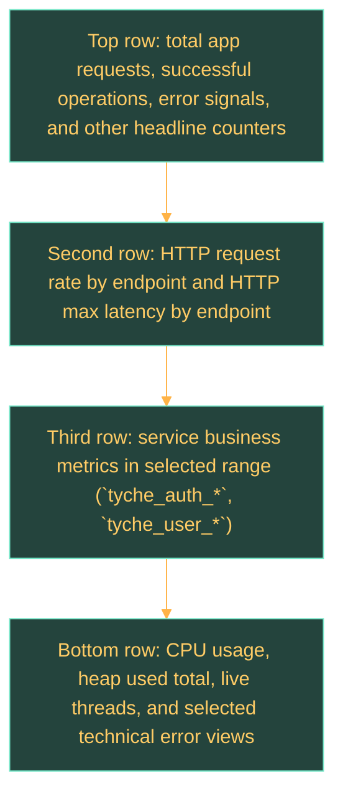

# User Service Observability

## Overview

This page explains the operational checks currently provided by the `user-service` Grafana dashboard and how those checks map to the metrics exposed by the service.

## Dashboard Summary

| Topic | Current State |
| --- | --- |
| Service | `user-service` |
| Dashboard file | `observability/grafana/dashboards/tyche-user-service-overview.json` |
| Datasource | Prometheus |
| Main scope | tyche_auth, tyche_user, HTTP behavior, runtime health |

## Dashboard Representation

The current dashboard is organized by diagnostic intent rather than by raw metric family.

## What The Dashboard Checks

| Area | Metrics used | What it helps validate |
| --- | --- | --- |
| Service business counters | `tyche_auth_*`, `tyche_user_*` | Whether the service is receiving requests and producing the expected domain outcomes in the selected range. |
| HTTP traffic | `http_server_requests_*` | Which endpoints are active and whether request volume or latency shifts by route. |
| Runtime health | `jvm_*`, `jdbc_*`, `system_cpu_usage` | CPU, heap pressure, live threads, and datasource health. |
| Unauthorized responses | `http_server_requests_seconds_count{status="401"}` plus service unauthorized counters | Which endpoints are returning `401` responses and whether the service emits a narrower business unauthorized signal. |

## Metric Description Reference

| Exported metric | Description |
| --- | --- |
| `tyche_auth_login_failure_total` | Failed login attempts recorded by the auth flow. |
| `tyche_auth_login_invalid_credentials_total` | Login attempts rejected because the provided credentials were invalid. |
| `tyche_auth_login_rate_limited_total` | Login requests rejected by rate limiting. |
| `tyche_auth_login_requests_total` | Total login requests received by the auth flow. |
| `tyche_auth_login_success_total` | Successful login requests that issued fresh credentials. |
| `tyche_auth_refresh_failure_total` | Failed refresh-token attempts recorded by the auth flow. |
| `tyche_auth_refresh_rate_limited_total` | Refresh-token requests rejected by rate limiting. |
| `tyche_auth_refresh_requests_total` | Total refresh-token requests received by the auth flow. |
| `tyche_auth_refresh_success_total` | Successful refresh-token operations that returned fresh credentials. |
| `tyche_auth_refresh_token_issued_total` | Refresh tokens persisted by login or token rotation flows. |
| `tyche_auth_refresh_token_revoked_total` | Refresh tokens revoked by logout, password changes, soft delete, or token rotation. |
| `tyche_auth_register_conflict_total` | Register requests rejected because the email or username already exists. |
| `tyche_auth_register_failure_total` | Failed user registration attempts recorded by the auth flow. |
| `tyche_auth_register_rate_limited_total` | Register requests rejected by rate limiting. |
| `tyche_auth_register_requests_total` | Total register requests received by the auth flow. |
| `tyche_auth_register_success_total` | Successful user registrations completed by the auth flow. |
| `tyche_user_current_password_invalid_total` | Password change requests rejected because the current password did not match. |
| `tyche_user_delete_requests_total` | Total authenticated account deletion requests. |
| `tyche_user_delete_success_total` | Successful authenticated account soft deletions. |
| `tyche_user_new_password_reused_total` | Password change requests rejected because the new password matched the current password. |
| `tyche_user_not_found_total` | User-area operations that targeted a user record not found as active. |
| `tyche_user_retrieve_requests_total` | Total authenticated user profile retrieval requests. |
| `tyche_user_retrieve_success_total` | Successful authenticated user profile retrievals. |
| `tyche_user_unauthorized_total` | User-area requests rejected because authentication was missing or invalid. |
| `tyche_user_update_requests_total` | Total authenticated user profile update requests. |
| `tyche_user_update_success_total` | Successful authenticated user profile updates. |
| `tyche_user_update_password_requests_total` | Total authenticated password change requests. |
| `tyche_user_update_password_success_total` | Successful authenticated password changes. |
| `tyche_user_username_conflict_total` | User update requests rejected because the requested username was already in use. |

## Metric Notes

- The service registers explicit Micrometer descriptions for detected business counters (`tyche_auth_*`, `tyche_user_*`), so Prometheus metadata and Grafana field inspection can explain what each metric counts.
- Counter names are declared in code with dotted Micrometer names such as `tyche.auth.login.requests`; Prometheus exposes them in snake case with the `_total` suffix, such as `tyche_auth_login_requests_total`.
- `http_server_requests_*` metrics provide the technical HTTP view and are useful when raw response behavior needs to be correlated with service-domain counters.
- `jvm_*` and `jdbc_*` metrics provide runtime context and should be read as supporting health signals rather than domain outcomes.

## Operational Notes

- Some panels are range-based, so they can legitimately appear empty when the selected time window does not include traffic for that flow.
- `tyche_user_unauthorized_total` is narrower than all HTTP `401` responses, which is why the dashboard also includes a dedicated `HTTP 401 by endpoint` view.
- This page should be updated whenever the dashboard layout, Prometheus queries, or service metrics change in a way that alters what the operational view is intended to confirm.
