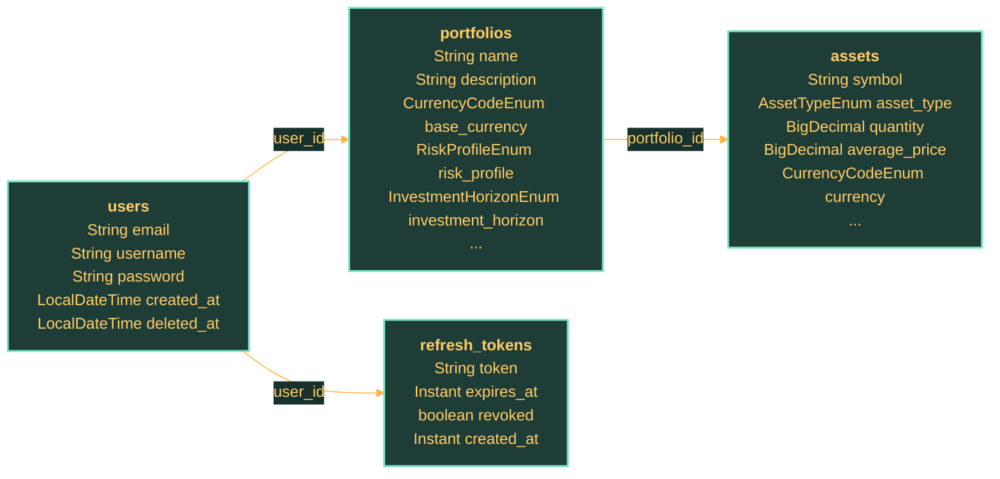

# Tyche-Wealth - User Service

## Overview

`user-service` is an implemented backend service in this repository. This README acts as the fastest operational entry point for the service: what it does, how to run it, what it exposes, what it stores, and where to go next for deeper documentation.

## Service Snapshot

| Aspect | Current State |
| --- | --- |
| Service name | `user-service` |
| Spring application name | `user-service` |
| Default local port | `8080` |
| Implemented endpoints | `6` |
| Persisted entities | `4` |
| Implementation slices | `config`, `controller`, `dto`, `entity`, `helper`, `mapper`, `repository`, `service`, `web` |

## Responsibilities

- Exposes the implemented authentication API for register, login, and refresh operations.
- Coordinates validation, token generation, refresh-token lifecycle handling, and persistence updates.
- Stores user-facing auth state and related portfolio or asset ownership data through JPA entities and repositories.

## Requirements

- Review build files and runtime configuration under `user-service/` before changing service behavior.
- Use the service documentation pages for API, data-model, and runtime detail.
- Keep secrets in local-only property files, never in committed source files.

## Run Locally

Typical local start path for this service:

```powershell
cd user-service
.\mvnw.cmd spring-boot:run
```

## Local Configuration

| Topic | Current State |
| --- | --- |
| Spring application name | `user-service` |
| Default local port | `8080` |
| Build tool | Maven project in the service root |
| Datasource | PostgreSQL-backed datasource configured through Spring properties |
| Security | Dedicated Spring security configuration present |
| Rate limiting | Endpoint-specific interceptor configuration present |

Configuration files:

- Repository root: `application-local.properties`
- Service-local overrides: `user-service/application-local.properties`

## Main Components

- API contracts and controller implementations define the externally visible HTTP surface.
- Service and helper classes contain orchestration, validation, token, and domain logic.
- Repositories and entities define persisted state and object relationships.
- Configuration and web classes provide security, rate limiting, and request interception support.

## Architecture Diagram

```mermaid
%%{init: {
  "theme": "base",
  "themeVariables": {
    "background": "#1c2c29",
    "primaryColor": "#24443d",
    "primaryTextColor": "#ffcc66",
    "primaryBorderColor": "#73e5c6",
    "lineColor": "#ffb347",
    "secondaryColor": "#203934",
    "tertiaryColor": "#294c44",
    "mainBkg": "#24443d",
    "secondBkg": "#203934",
    "tertiaryBkg": "#294c44",
    "clusterBkg": "#17312d",
    "clusterBorder": "#57c8a8",
    "nodeBkg": "#24443d",
    "nodeBorder": "#73e5c6",
    "defaultLinkColor": "#ffb347",
    "titleColor": "#ffcc66",
    "textColor": "#ffcc66",
    "edgeLabelBackground": "#17312d",
    "actorBkg": "#24443d",
    "actorBorder": "#73e5c6",
    "actorTextColor": "#ffcc66",
    "actorLineColor": "#ffb347",
    "signalColor": "#ffb347",
    "signalTextColor": "#ffcc66",
    "labelBoxBkgColor": "#17312d",
    "labelBoxBorderColor": "#57c8a8",
    "labelTextColor": "#ffcc66",
    "loopTextColor": "#ffcc66",
    "noteBkgColor": "#294c44",
    "noteBorderColor": "#82e7cb",
    "noteTextColor": "#ffcc66",
    "activationBkgColor": "#2c5a50",
    "activationBorderColor": "#73e5c6",
    "sectionBkgColor": "#1b3531",
    "altSectionBkgColor": "#22413b",
    "gridColor": "rgba(255, 179, 71, 0.22)"
  },
  "themeCSS": ".messageText, .messageText tspan, .label text, .label tspan, .edgeLabel text, .edgeLabel tspan, .nodeLabel, .nodeLabel p, .nodeLabel span, .label foreignObject, .label foreignObject div, .cluster-label text, .cluster-label tspan, .actor text, .actor tspan, .loopText, .noteText, .er text, .er tspan, .er.entityLabel, .er.attributeText, .er.relationshipLabel, .er foreignObject div, .er foreignObject span, .er foreignObject td, .er foreignObject th { fill: #ffcc66 !important; color: #ffcc66 !important; } .messageLine0, .messageLine1, .flowchart-link, .edgePath path, .actor-line, .er.relationshipLine { stroke: #ffb347 !important; fill: none !important; } .arrowheadPath, marker path { stroke: #ffb347 !important; fill: #ffb347 !important; } .er rect, .er .entityBox, .er .attributeBoxEven, .er .attributeBoxOdd { fill: #24443d !important; stroke: #73e5c6 !important; } .er .relationshipLabelBox { fill: #17312d !important; stroke: #57c8a8 !important; } .er foreignObject, .er foreignObject div, .er foreignObject table { background: #24443d !important; } .er foreignObject tr:nth-child(odd), .er foreignObject tr:nth-child(odd) td { background: #24443d !important; } .er foreignObject tr:nth-child(even), .er foreignObject tr:nth-child(even) td { background: #2b4f47 !important; } .er foreignObject td, .er foreignObject th { border-color: #73e5c6 !important; }"
}}%%
flowchart LR
  Client[Client App] --> Api["REST API / Controllers"]
  Api --> Service["Service Layer and Helpers"]
  Service --> Repo["Repositories"]
  Repo --> Db[("PostgreSQL")]
  Api --> Security["Security Config"]
  Api --> RateLimit["Rate Limit Interceptors"]
```



## Implemented Endpoints

### `AuthApi.java`

| Method | Path | Purpose | Operational Note |
| --- | --- | --- | --- |
| `POST` | `/tyche-wealth/user-service/v1/auth/register` | Creates a new user account and returns the created user representation. | Persists a new active user record and is subject to dedicated registration rate limiting and uniqueness checks. |
| `POST` | `/tyche-wealth/user-service/v1/auth/login` | Authenticates a user and returns `tokenType`, `accessToken`, `refreshToken`, `expiresIn`, and the mapped user representation. | Validates credentials, revokes any previously active refresh tokens for the user, issues a new access token and refresh token, and records auth metrics. |
| `POST` | `/tyche-wealth/user-service/v1/auth/refresh` | Validates the submitted refresh token, rotates refresh-token state, and returns `tokenType`, `accessToken`, `expiresIn`, and a replacement refresh token. | Revokes the submitted active refresh token, persists a replacement refresh token, returns a new access token, and fails with `401` when the provided refresh token is invalid, expired, or already revoked. |
| `POST` | `/tyche-wealth/user-service/v1/auth/logout` | Accepts a refresh token request body and logs the user out by revoking the submitted active refresh token. | Requires a valid refresh-token request body, revokes the submitted active refresh token, and returns `204 No Content`; it does not implement server-side access-JWT invalidation or cache cleanup. |

### `UserApi.java`

| Method | Path | Purpose | Operational Note |
| --- | --- | --- | --- |
| `GET` | `/tyche-wealth/user-service/v1/user/me` | Returns the authenticated active user's `id`, `email`, `username`, and `createdAt`; sensitive fields such as `password`, `deletedAt`, and related collections are omitted from the response DTO. | Requires a valid `Authorization: Bearer <token>` header for an active non-deleted user and returns only the mapped user DTO fields. |
| `DELETE` | `/tyche-wealth/user-service/v1/user/me` | Soft-deletes the authenticated active user by setting `deletedAt`, preserves the stored record, revokes active refresh tokens, and returns no response body. | Requires a valid bearer token for an active non-deleted user, revokes active refresh tokens, performs a soft delete by setting `deletedAt`, and returns `204 No Content`. |

## Data Model Summary

| Entity | Table | Role | Key Relations |
| --- | --- | --- | --- |
| `AssetEntity` | `assets` | Represents an asset position that belongs to a portfolio. | PortfolioEntity |
| `PortfolioEntity` | `portfolios` | Groups assets and investment preferences owned by a user. | AssetEntity, UserEntity |
| `RefreshTokenEntity` | `refresh_tokens` | Stores refresh tokens, expiry, and revocation state linked to a user. | UserEntity |
| `UserEntity` | `users` | Stores the primary user identity and credential state. | PortfolioEntity |

## Database Notes

| Aspect | Current State |
| --- | --- |
| Service | `user-service` |
| Detected entities | `4` |
| Tables represented | `4` |
| Many-to-one relations | `3` |
| Liquibase changelogs | Present |



## Soft-delete Strategy

- `DELETE /user/me` performs a soft delete: `UserServiceImpl.delete()` delegates to `userHelper.softDelete()`, which revokes active refresh tokens, sets `deletedAt`, and saves the user record instead of removing the row.
- Active-user lookups are filtered through repository methods such as `findByIdAndDeletedAtIsNull()`, `findByEmailAndDeletedAtIsNull()`, and `findByUsernameAndDeletedAtIsNull()` so soft-deleted users are excluded from normal service flows.
- Related data is not cascaded away by the current mappings. `PortfolioEntity.user` and `RefreshTokenEntity.user` are `@ManyToOne(optional = false)` with foreign-key constraints from `portfolios.user_id` and `refresh_tokens.user_id` to `users.id`. Soft delete preserves those rows; refresh tokens are explicitly revoked, while portfolios remain linked to the retained user row.
- No restore pathway is implemented in the current code. There is no service or repository method that clears `deletedAt`, so account recovery would require a new code path or direct data repair outside the implemented API.

- The ER diagram is derived from JPA entities, so it reflects object relationships that are implemented in code now.
- Liquibase changelogs should be read together with the entities when reviewing schema evolution or rollout risk.
- Refresh-token persistence is part of the core auth contract, not just an implementation detail, because rotation and revocation depend on this table.
- Portfolio and asset tables are already present in persistence, even if the current HTTP surface is still centered on authentication.

## Security and Operational Notes

- Password handling is centralized in `SecurityConfig` through a `BCryptPasswordEncoder`, so raw credentials are not persisted directly from controller input.
- Access tokens are signed as JWTs with `HS256`; the signing secret is injected from `app.auth.jwt.secret`, and the configured access-token TTL is `${JWT_ACCESS_TOKEN_TTL_SECONDS:900}` seconds.
- Refresh tokens are generated with `SecureRandom`, encoded for transport, persisted in the `refresh_tokens` table, and revoked or rotated on use; the configured refresh-token TTL is `${JWT_REFRESH_TOKEN_TTL_SECONDS:1209600}` seconds.
- Register, login, and refresh routes are protected by dedicated MVC interceptors. Throttling is keyed by `HttpServletRequest.getRemoteAddr()` and enforced before the request reaches controller logic.
- Registration is limited to `${AUTH_REGISTER_RATE_LIMIT_MAX_REQUESTS:5}` requests per `${AUTH_REGISTER_RATE_LIMIT_WINDOW_SECONDS:300}` seconds per client address.
- Login is limited to `${AUTH_LOGIN_RATE_LIMIT_MAX_REQUESTS:10}` requests per `${AUTH_LOGIN_RATE_LIMIT_WINDOW_SECONDS:60}` seconds per client address.
- Refresh is limited to `${AUTH_REFRESH_RATE_LIMIT_MAX_REQUESTS:10}` requests per `${AUTH_REFRESH_RATE_LIMIT_WINDOW_SECONDS:60}` seconds per client address.
- Metrics are emitted for auth requests, successes, failures, invalid credentials, token issuance, token revocation, and rate-limited outcomes, which makes abuse patterns and auth regressions observable.
- Secrets are expected from environment variables or local-only property imports, which keeps JWT secrets and datasource credentials out of committed defaults.

## Runtime Notes

- Spring application name: `user-service`
- Default configured port: `8080`
- Requires a PostgreSQL-backed datasource according to the current service configuration.
- Build and local execution are driven from the service Maven project.

## Test Coverage View

| Test Area | Current State |
| --- | --- |
| Integration | `2` files |
| Repository | `4` files |
| Mapper | `3` files |
| Web / Interceptor | `2` files |
| Application Smoke | `1` files |
| Test resource files | `13` fixtures and auxiliary files |
| Current line coverage | `85.62%` |
| Current branch coverage | `51.55%` |
| Coverage instrumentation | JaCoCo Maven plugin is configured in the service build lifecycle. |
| Coverage report | HTML report is generated at `user-service/target/site/jacoco/index.html` after `mvn verify`. |

- Integration coverage is present around the auth controller flow, so the HTTP contract is not documented in isolation from tests.
- Repository tests cover the persistence layer directly, which is useful when changing entities, queries, or Liquibase-backed assumptions.
- Rate-limiting and web interception behavior has dedicated tests, which matters because auth throttling is part of the live contract.
- Mapper tests exist, so DTO and entity translation logic is not left completely implicit.
- Current JaCoCo totals are `85.62%` line coverage and `51.55%` branch coverage, based on the latest generated report in `target/site/jacoco/jacoco.xml`.
- JaCoCo is wired into the Maven `verify` phase, so the service can publish a coverage report instead of relying only on raw test counts.
- Coverage review should start from `user-service/target/site/jacoco/index.html` after a local or CI `mvn verify` run.

## Documentation Links

| Page | Why open it |
| --- | --- |
| `docs/knowledge/services/user-service/overview.md` | Service scope, responsibilities, and architecture-facing summary. |
| `docs/knowledge/services/user-service/api.md` | Implemented endpoints, validation rules, and API diagrams. |
| `docs/knowledge/services/user-service/data-model.md` | Entities, relationships, and persistence details. |
| `docs/knowledge/services/user-service/runtime.md` | Setup, runtime configuration, security, and operations. |
| `docs/knowledge/services/user-service/observability.md` | Dashboard intent, metric groups, and operational checks. |
