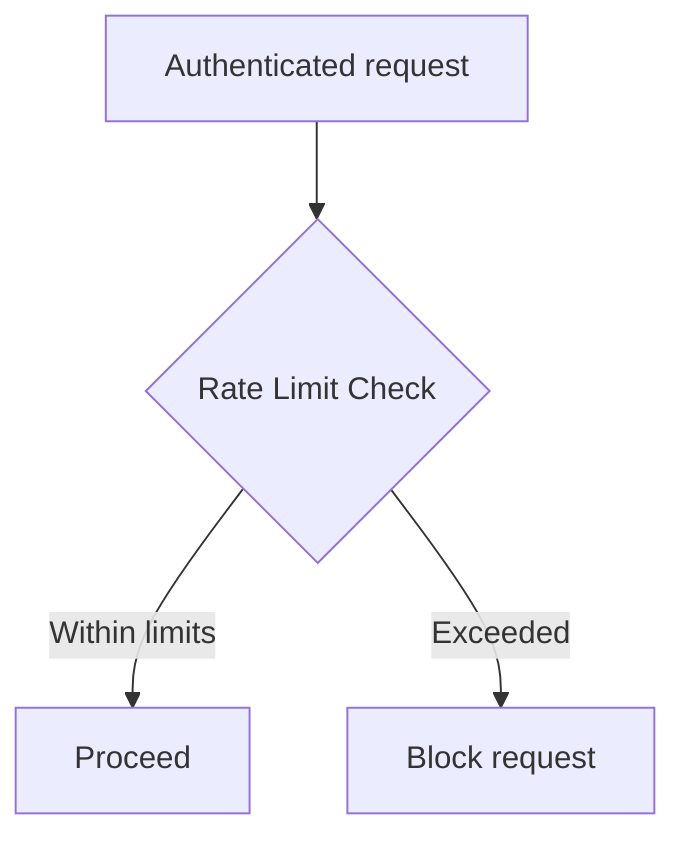

# User Service Runtime

## Overview
This page consolidates local setup, runtime configuration, security, and operational notes for the user-service application.

## Runtime Summary
The user-service application requires these key runtime settings:

**Spring Application Name:** `user-service`
**Default Local Port:** `8080`
**Build Tool:** Maven project at the service root
**Datasource:** PostgreSQL-backed configured via Spring properties
**Security:** Separate Spring security configuration included
**Rate Limiting:** Configurable for auth-related endpoints

## Requirements
For proper operation, the user-service application needs:

1.  **Spring Application Name:** Set to `user-service`
2.  **Default Port:** Must use `8080`
3.  **Datasource:** Requires PostgreSQL with parameters matching configured database settings

## Local Setup and Execution

### Running the Service
To start the service locally using the checked-in build tooling:
```powershell
cd user-service
.\mvnw.cmd spring-boot:run
```

Ensure the backing infrastructure, particularly the PostgreSQL database, is operational before starting.

### Configuration Files
Configuration for the user-service can be supplied via files or environment variables.

## Configuration Details

### Datasource Configuration
Key parameters for the PostgreSQL datasource:

| Parameter                               | Description                               |
| :------------------------------- | :---------------------------------------- |
| `spring.datasource.url`           | PostgreSQL connection string              |
| `spring.datasource.username`      | Database username                         |
| `spring.datasource.password`      | Database password                         |
| `spring.datasource.driver-class-name` | JDBC driver class name                   |

### Authentication and Security
Several properties manage authentication behavior and security aspects:

#### JWT Configuration
*   `app.auth.jwt.access-token-ttl-seconds`
*   `app.auth.jwt.refresh-token-ttl-seconds`
*   `app.auth.jwt.secret`

#### Rate Limiting Configuration
Configuration for API request rate limiting:

| Parameter                                      | Description                                      |
| :------------------------------------------ | :----------------------------------------------- |
| `app.auth.login-rate-limit.max-requests`      | Max login attempts per rate limit period        |
| `app.auth.login-rate-limit.window-seconds`    | Time period (seconds) for login rate limiting   |
| `app.auth.register-rate-limit.max-requests`   | Max registration requests per time window        |
| `app.auth.register-rate-limit.window-seconds` | Duration of the registration rate window (seconds) |
| `app.auth.refresh-rate-limit.max-requests`    | Max refresh token requests per period            |
| `app.auth.refresh-rate-limit.window-seconds`  | Time window (seconds) for refresh rate limiting   |

### Spring Framework Configuration
Base configuration parameters:

| Parameter                             | Description                                               |
| :---------------------------- | :-------------------------------------------------------- |
| `spring.application.name`       | Logical application name (set to `user-service`)        |
| `server.port`                   | Service HTTP port (default `8080`)                      |
| `spring.jpa.hibernate.ddl-auto` | Hibernate database schema mode                          |
| `spring.jpa.show-sql`            | Enable SQL logging (disabled for production) **\***

\*\*Note:\*\* The default settings rely on an **\*existing\*** PostgreSQL database for persistence.

## Security and Observability
Security is configured via a dedicated Spring security class.

### Rate Limiting Implementation
Protected endpoints (`/auth/register`, `/auth/login`, `/auth/refresh`) are secured by a rate-limiting interceptor. The enforcement flow:


Monitoring includes **observation** of authentication attempts and outcomes.

## Operational Considerations
Operational best practices:

*   All **confidential data** must be secured outside version control.
*   This page should **be immediately updated** with all configuration and security **changes**.

The documented surface covers the runtime aspects relevant to user-service's **authentication functionality** and endpoints.
