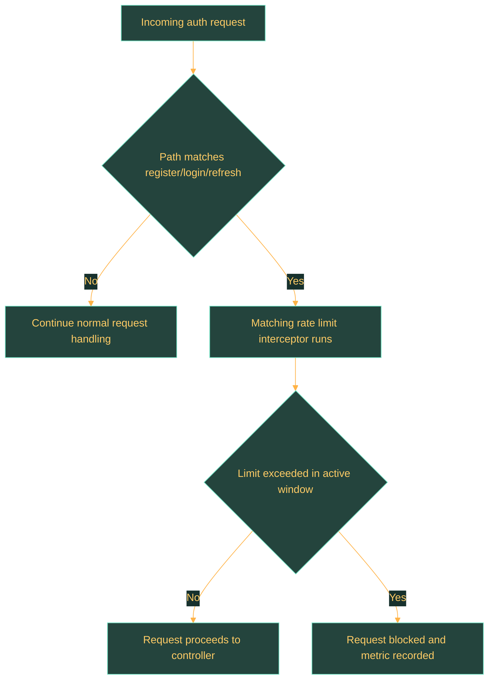

# User Service Runtime

## Overview

This page consolidates local setup, runtime configuration, security, and operational notes for `user-service`.

## Runtime Summary

| Topic | Current State |
| --- | --- |
| Spring application name | `user-service` |
| Default local port | `8080` |
| Build tool | Maven project in the service root |
| Datasource | PostgreSQL-backed datasource configured through Spring properties |
| Security | Dedicated Spring security configuration present |
| Rate limiting | Endpoint-specific interceptor configuration present |

## Requirements

- Spring application name: `user-service`
- Default configured port: `8080`
- Requires a PostgreSQL-backed datasource according to the current service configuration.
- Build and local execution are driven from the service Maven project.

## Run Locally

- Start the backing infrastructure expected by the service, especially the configured PostgreSQL instance.
- Provide local-only overrides through `application-local.properties` in the repository root or service folder.
- Run the service with the checked-in build tooling:

```powershell
cd user-service
.\mvnw.cmd spring-boot:run
```

## Local Configuration

### Datasource

| Parameter | Description |
| --- | --- |
| `spring.datasource.driver-class-name` | JDBC driver class used by the service datasource. |
| `spring.datasource.password` | Database password for the configured datasource. |
| `spring.datasource.url` | Datasource connection URL. |
| `spring.datasource.username` | Database username for the configured datasource. |

### JWT and tokens

| Parameter | Description |
| --- | --- |
| `app.auth.jwt.access-token-ttl-seconds` | Lifetime of generated access tokens in seconds. |
| `app.auth.jwt.refresh-token-ttl-seconds` | Lifetime of generated refresh tokens in seconds. |
| `app.auth.jwt.secret` | Signing secret used for JWT generation and validation. |

### Rate limiting

| Parameter | Description |
| --- | --- |
| `app.auth.login-rate-limit.max-requests` | Maximum login requests allowed inside the configured rate-limit window. |
| `app.auth.login-rate-limit.window-seconds` | Window length in seconds for login rate limiting. |
| `app.auth.refresh-rate-limit.max-requests` | Maximum refresh requests allowed inside the configured rate-limit window. |
| `app.auth.refresh-rate-limit.window-seconds` | Window length in seconds for refresh-token rate limiting. |
| `app.auth.register-rate-limit.max-requests` | Maximum register requests allowed inside the configured rate-limit window. |
| `app.auth.register-rate-limit.window-seconds` | Window length in seconds for registration rate limiting. |

### Spring and bootstrap

| Parameter | Description |
| --- | --- |
| `server.port` | Default HTTP port exposed by the service. |
| `spring.application.name` | Logical Spring application name used by the service. |
| `spring.config.import` | Additional configuration import path resolved during startup. |
| `spring.jpa.hibernate.ddl-auto` | Hibernate schema-management mode used at runtime. |
| `spring.jpa.show-sql` | Enables SQL statement logging when set for development use. |
| `spring.liquibase.change-log` | Liquibase changelog entry point used for schema evolution. |

## Security, Rate Limiting, and Observability

- Security is configured explicitly through a dedicated Spring configuration class.
- Register, login, and refresh paths are protected by dedicated rate-limit interceptor wiring.

### Rate Limiting Flow


- Metrics classes record request, success, failure, and rate-limited outcomes for auth operations.

## Operational Notes

- Keep secrets out of committed configuration and out of generated documentation.
- Revisit this page whenever configuration keys, interceptors, metrics, or local startup assumptions change.
- Runtime notes are currently centered on the implemented authentication surface because that is the code-backed API exposed today.
